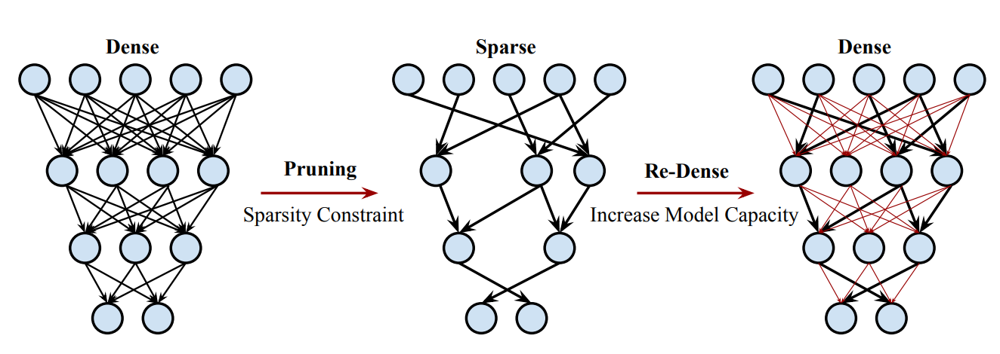
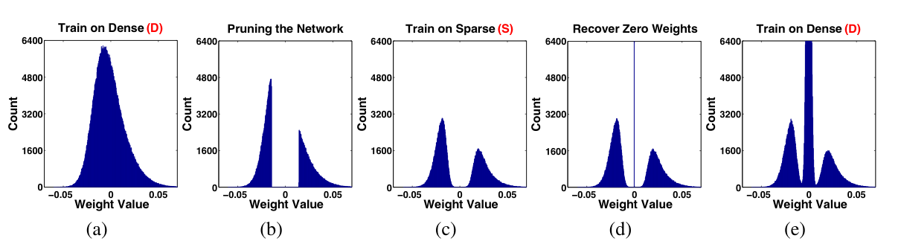

## DSD: Dense-Sparse-Dense Training for Deep Neural Networks

Implementation of <a href="https://arxiv.org/abs/1607.04381">DSD: Dense-Sparse-Dense Training for Deep Neural Networks</a> in Tensorflow 2.



> Dense-sparse-dense training framework regularizes neural networks by pruning and then restoring connections. The paper method learns which connections are important during the initial dense solution. Then it regularizes the network by pruning the unimportant connections and retraining to a sparser and more robust solution with same or better accuracy. Finally, the pruned connections are restored and the entire network is retrained again. This increases the dimensionality of parameters, and thus model capacity, from the sparser model.

## Citations

```bibtex
@misc{1607.04381,
    Author = {Song Han and Jeff Pool and Sharan Narang and Huizi Mao and Enhao Gong and Shijian Tang and Erich Elsen and Peter Vajda and Manohar Paluri and John Tran and Bryan Catanzaro and William J. Dally},
    Title = {DSD: Dense-Sparse-Dense Training for Deep Neural Networks,
    Year = {2016},
    Eprint = {arXiv:1607.04381},
}
```